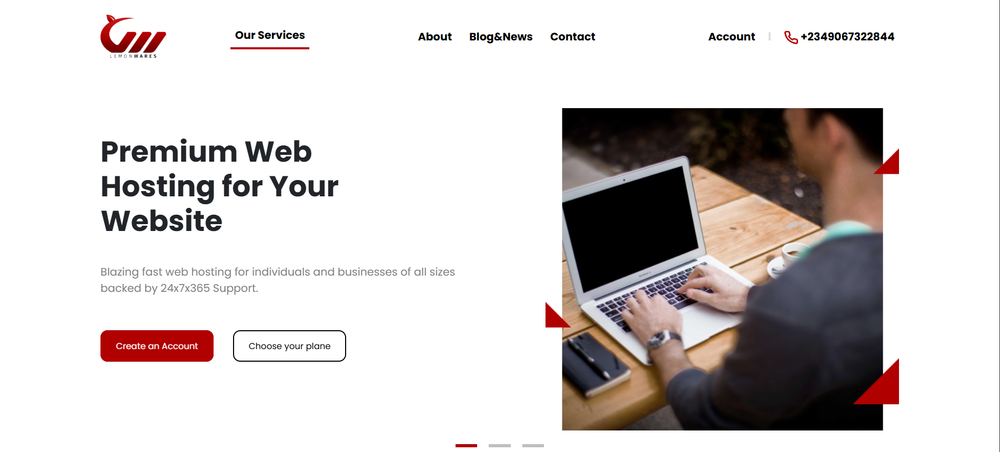

# Hosting Company Landing Page

This project is a simple, responsive landing page designed for a web hosting company ("Lemon Wares"). It was built using **HTML**, **CSS**, and the **Bootstrap 5** framework.

## Description

The landing page aims to provide an engaging overview of the hosting company's services, encouraging visitors to learn more or sign up. It features several key sections to showcase features, pricing plans, and customer testimonials, mimicking a provided design template.

### [Live Demo](https://leenoyoon.github.io/IXCoders-intern-second/)

## Screenshot

## Key Sections

The page includes the following main sections:

1.  **Navigation Bar:** A responsive navbar with the company logo, primary navigation links, account link, and a contact phone number.
2.  **Hero Section:** A carousel/slider featuring a prominent headline, descriptive text, call-to-action buttons ("Create an Account", "Choose your plane"), and an image (`hero.png`). Includes indicator dots for slide navigation.
3.  **"Why Us" / Features Section 1 (Logos):** Displays a title ("True Cloud Web Hosting") and description alongside a grid of supported technology logos (e.g., cPanel, Imunify360, LiteSpeed, Softaculous, WordPress, Cloudflare) arranged in two rows.
4.  **Features Section 2 (Icon Slider):** A carousel/slider showcasing four key features (e.g., "99.9% Uptime", "Blazing Fast Web Hosting", "Free SSL Certificates", "24x7 Friendly Support") with icons, titles, and descriptions. Includes previous/next arrow controls using custom SVG icons (`prev.svg`, `next.svg`).
5.  **Pricing Section:**
    * Main title ("Ready to get started...") and subtitle ("Choose the package...").
    * A toggle switch (`form-switch`) to alternate between Monthly and Yearly pricing views, including a discount badge for the Yearly option.
    * A tab system (`nav-tabs`) to switch between "Basic" and "Premium" plan categories.
    * Pricing cards (`pricing-card`) displayed within the active tab (currently populated for "Basic"), detailing different plans ("Starter", "Standard", "Suprem") with features listed using checkmark icons (`Checkmark.svg`).
6.  **Testimonials Section:**
    * Section title ("Real Stories...") and subtitle ("Get inspired...") positioned alongside a decorative background quote mark (`Quote Mark.svg`).
    * A two-column layout displaying three testimonial cards (`testimonial-card`), each containing a small quote icon (`Quote Mark (1).svg`), customer logo, testimonial text, customer name, and title.
7.  **"We Serve" Section (Logos):** Displays a title ("We serve over 100...") and description alongside another grid of client/partner logos.
8.  **Call to Action (CTA) Section:** A distinct box (`call-us-box`) with a light background, decorative background elements (`Elements.svg`), a headline ("We're here to make your website awesome."), and a primary call-to-action button ("Get in touch with us").
9.  **Footer:** A dark red footer (`site-footer`) containing the company logo (white version), a brief description, social media icons (Facebook, Instagram, X/Twitter), multiple columns of navigation links (Service, Hosting, Company, Help), and a copyright notice.

## Technologies Used

* **HTML5:** For structuring the page content.
* **CSS3:** For custom styling, layout adjustments, and overriding default Bootstrap styles.
* **Bootstrap 5:** CSS/JS framework for responsive design and pre-built components (Navbar, Carousel, Grid System, Tabs, Cards, Buttons, Forms).
* **Google Fonts (Poppins):** Used as the primary font for the page.
* **SVG Images:** Used extensively for logos and icons for scalability.

## How to Run

1.  Download or clone this repository.
2.  Open the `index.html` file in your web browser.

## Customization
Bootstrap's default styles were overridden using custom classes defined in `style.css` to achieve the specific design requirements regarding colors, fonts, spacing, component styling (like tabs, cards, carousels), and responsive behavior across different screen sizes. Media queries (`@media`) were used to adjust layouts and styles for tablet (`max-width: 991px`) and mobile (`max-width: 768px`) views. Custom classes like `.hero-button-main`, `.pricing-card`, `.testimonial-card`, `.call-us-box`, `.site-footer` etc., contain specific styling rules.s